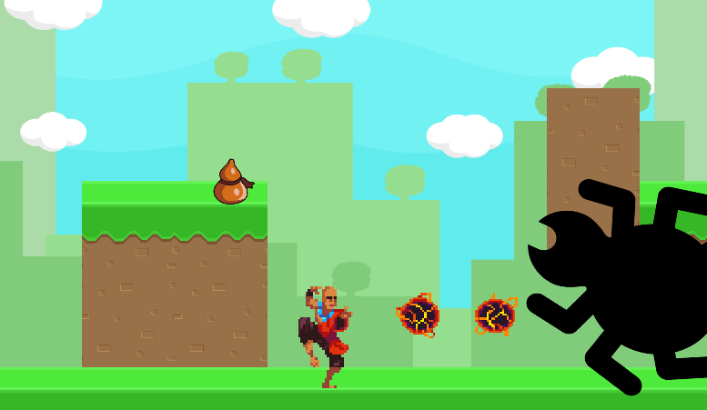

# Bug Buster: Unity Game

## Technologies Used:
- C#
- Unity Game Engine

## Resources:
### Tutorial Links:
// 2D Movement: https://www.youtube.com/watch?v=dwcT-Dch0bA
// 2D Animation: https://www.youtube.com/watch?v=hkaysu1Z-N8
// 2D Camera: https://www.youtube.com/watch?v=2jTY11Am0Ig
// 2D Shooting: https://www.youtube.com/watch?v=wkKsl1Mfp5M&t=961s
// Dialogue Box: https://www.youtube.com/watch?v=_nRzoTzeyxU
// Health Bar: https://www.youtube.com/watch?v=BLfNP4Sc_iA&t=153s
// https://www.youtube.com/watch?v=7nxKAtxGSn8
// https://www.youtube.com/watch?v=zc8ac_qUXQY
// https://www.youtube.com/watch?v=Iv7A8TzreY4
### GitHub with Unity:
// https://www.youtube.com/watch?v=qpXxcvS-g3g
### The Noun Project:
// https://thenounproject.com/search/?q=bug&i=887247